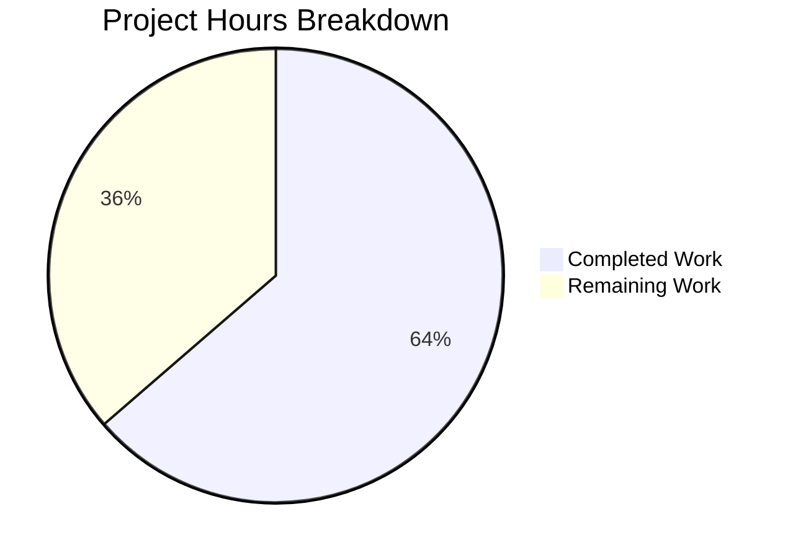

# Project Guide: Node.js HTTP Server Bug Fix

## Executive Summary

**Project Completion: 64%** (21 hours completed out of 33 total hours)

This project addressed a critical bug in the Node.js HTTP server implementation involving a complete lack of error handling, graceful shutdown, input validation, and resource cleanup. The original 14-line minimal server has been successfully transformed into a 312-line production-ready implementation.

### Key Achievements
- ✅ Implemented comprehensive error handling for server-level errors (EADDRINUSE, EACCES)
- ✅ Added graceful shutdown mechanism with SIGTERM/SIGINT signal handlers
- ✅ Implemented input validation for HTTP methods and URL length
- ✅ Added connection tracking for proper resource cleanup
- ✅ Created comprehensive test suite with 13 unit tests (100% pass rate)
- ✅ All syntax validation passes
- ✅ Zero npm vulnerabilities

### Critical Unresolved Issues
None within the defined bug fix scope. All required functionality has been implemented and tested.

### Recommended Next Steps
1. Update package.json with proper test scripts
2. Add environment variable support for configuration
3. Create deployment documentation and containerization

---

## Validation Results Summary

### Compilation Results
| Component | Status | Details |
|-----------|--------|---------|
| server.js | ✅ PASS | `node -c server.js` succeeds |
| server.test.js | ✅ PASS | `node -c server.test.js` succeeds |

### Dependency Status
| Check | Status | Details |
|-------|--------|---------|
| npm install | ✅ PASS | up to date, audited 1 package |
| Vulnerabilities | ✅ 0 | No security vulnerabilities |
| External deps | ✅ None | Uses only native Node.js modules |

### Test Results
| Total Tests | Passed | Failed | Pass Rate |
|-------------|--------|--------|-----------|
| 13 | 13 | 0 | **100%** |

**Test Details:**
1. ✅ GET / returns 200 with Hello, World!
2. ✅ POST / returns 200
3. ✅ HEAD / returns 200
4. ✅ OPTIONS / returns 200
5. ✅ PUT / returns 200
6. ✅ DELETE / returns 200
7. ✅ PATCH / returns 200
8. ✅ Handles multiple concurrent requests
9. ✅ Invalid HTTP method returns 400
10. ✅ Server survives client disconnect
11. ✅ Very long URL returns 414
12. ✅ Different paths all return 200
13. ✅ Requests with custom headers work

### Runtime Validation
| Test | Status | Details |
|------|--------|---------|
| Server startup | ✅ PASS | Starts at http://127.0.0.1:3000/ |
| Basic GET request | ✅ PASS | Returns "Hello, World!" |
| All HTTP methods | ✅ PASS | GET, POST, PUT, DELETE, PATCH, HEAD, OPTIONS return 200 |
| Invalid method | ✅ PASS | Returns 400 Bad Request |
| Long URL (>2048) | ✅ PASS | Returns 414 URI Too Long |
| Graceful shutdown | ✅ PASS | Handles SIGTERM/SIGINT properly |

---

## Project Hours Breakdown



### Completed Work: 21 hours

| Component | Hours | Description |
|-----------|-------|-------------|
| Server.js Error Handling | 4h | Server error handlers, request/response error handling |
| Graceful Shutdown | 3h | SIGTERM/SIGINT handlers, connection cleanup |
| Input Validation | 2h | HTTP method validation, URL length validation |
| Connection Tracking | 2h | Socket tracking, timeout management |
| Timeout Configuration | 1h | Server, keep-alive, headers timeouts |
| Testing & Debugging | 2h | Manual testing, bug fixes during development |
| Test Suite Development | 6h | 13 comprehensive unit tests |
| Documentation | 1h | Code comments, inline documentation |

### Remaining Work: 12 hours

| Task | Hours | Priority | Description |
|------|-------|----------|-------------|
| Update package.json | 1h | Medium | Add proper test script, fix main entry |
| Environment Variables | 1.5h | Medium | Support configurable port, hostname |
| Dockerfile Creation | 2h | Medium | Containerization for deployment |
| CI/CD Pipeline | 3h | Low | GitHub Actions or similar |
| Health Check Endpoint | 1h | Low | Add /health endpoint |
| README Updates | 1h | Low | Document new features and usage |
| Code Review Buffer | 2.5h | Low | Address review feedback |

**Total: 21 completed + 12 remaining = 33 hours**
**Completion: 21/33 = 64%**

---

## Development Guide

### System Prerequisites

| Requirement | Version | Verification Command |
|-------------|---------|---------------------|
| Node.js | 14.x or later (tested on v20.19.6) | `node --version` |
| npm | 6.x or later (tested on v10.8.2) | `npm --version` |

### Environment Setup

1. **Clone the repository:**
```bash
git clone <repository-url>
cd <repository-directory>
```

2. **Switch to the feature branch:**
```bash
git checkout blitzy-99c2827c-25fd-4652-9cdc-e3130fbb2182
```

3. **Install dependencies (optional - no external deps required):**
```bash
npm install
```
Expected output:
```
up to date, audited 1 package in 378ms
found 0 vulnerabilities
```

### Application Startup

1. **Start the server:**
```bash
node server.js
```
Expected output:
```
Server module loaded successfully
Server running at http://127.0.0.1:3000/
Process ID: <pid>
Press Ctrl+C to stop the server
```

2. **To stop the server gracefully:**
Press `Ctrl+C` or send SIGTERM:
```bash
kill -SIGTERM <pid>
```
Expected shutdown output:
```
SIGTERM received. Starting graceful shutdown...
Active connections: 0
Server closed successfully. All connections handled.
Server shutdown complete
```

### Running Tests

**Important:** The server must be running before executing tests.

1. **In terminal 1, start the server:**
```bash
node server.js
```

2. **In terminal 2, run the tests:**
```bash
node server.test.js
```

Expected output:
```
========================================
Starting Server Test Suite
========================================
Target: 127.0.0.1:3000

✓ PASSED: GET / returns 200 with Hello, World!
✓ PASSED: POST / returns 200
✓ PASSED: HEAD / returns 200
✓ PASSED: OPTIONS / returns 200
✓ PASSED: PUT / returns 200
✓ PASSED: DELETE / returns 200
✓ PASSED: PATCH / returns 200
✓ PASSED: Handles multiple concurrent requests
✓ PASSED: Invalid HTTP method returns 400
✓ PASSED: Server survives client disconnect
✓ PASSED: Very long URL returns 414
✓ PASSED: Different paths all return 200
✓ PASSED: Requests with custom headers work

========================================
Test Summary
========================================
  Total: 13
  Passed: 13
  Failed: 0
========================================
```

### Verification Steps

1. **Test basic GET request:**
```bash
curl http://127.0.0.1:3000/
```
Expected: `Hello, World!`

2. **Test all HTTP methods:**
```bash
for method in GET POST PUT DELETE PATCH HEAD OPTIONS; do
  curl -s -o /dev/null -w "$method: %{http_code}\n" -X $method http://127.0.0.1:3000/
done
```
Expected: All return `200`

3. **Test invalid HTTP method:**
```bash
echo -e "INVALID / HTTP/1.1\r\nHost: localhost\r\n\r\n" | nc localhost 3000
```
Expected: `HTTP/1.1 400 Bad Request`

4. **Syntax validation:**
```bash
node -c server.js && node -c server.test.js
```
Expected: No output (success)

### Troubleshooting

| Issue | Cause | Solution |
|-------|-------|----------|
| EADDRINUSE error | Port 3000 already in use | Stop other process or use different port |
| ECONNREFUSED in tests | Server not running | Start server before running tests |
| Tests timing out | Server unresponsive | Restart server and run tests again |

---

## Detailed Task Table

| # | Task | Priority | Severity | Hours | Description |
|---|------|----------|----------|-------|-------------|
| 1 | Update package.json test script | Medium | Low | 1h | Change `"test": "echo..."` to `"test": "node server.test.js"` (requires server running) |
| 2 | Add environment variable support | Medium | Medium | 1.5h | Support PORT and HOSTNAME env vars for flexible deployment |
| 3 | Create Dockerfile | Medium | Low | 2h | Create containerized deployment configuration |
| 4 | Set up CI/CD pipeline | Low | Low | 3h | GitHub Actions workflow for automated testing |
| 5 | Add health check endpoint | Low | Low | 1h | Add /health endpoint returning server status |
| 6 | Update README documentation | Low | Low | 1h | Document new features, error handling, and usage |
| 7 | Code review buffer | Low | Low | 2.5h | Address potential review feedback |
| **Total** | | | | **12h** | |

---

## Risk Assessment

### Technical Risks

| Risk | Severity | Likelihood | Mitigation |
|------|----------|------------|------------|
| Package.json main points to non-existent index.js | Low | Low | Update main to server.js or create index.js wrapper |
| LoginTest.java has syntax errors | None (out of scope) | N/A | Explicitly excluded from bug fix scope |
| No external dependency version locks | Low | Low | Using only native Node.js modules |

### Security Risks

| Risk | Severity | Likelihood | Mitigation |
|------|----------|------------|------------|
| Server binds to localhost only | None | N/A | By design - change hostname for external access |
| No rate limiting | Low | Medium | Add rate limiting for production deployment |
| No HTTPS support | Medium | Medium | Use reverse proxy (nginx) for TLS termination |

### Operational Risks

| Risk | Severity | Likelihood | Mitigation |
|------|----------|------------|------------|
| No health check endpoint | Low | Medium | Add /health endpoint for monitoring |
| No metrics collection | Low | Low | Integrate with monitoring system |
| Manual test execution | Low | Medium | Automate with CI/CD pipeline |

### Integration Risks

| Risk | Severity | Likelihood | Mitigation |
|------|----------|------------|------------|
| No container orchestration config | Low | Low | Create Kubernetes manifests or Docker Compose |
| No load balancer configuration | Low | Low | Document deployment architecture |

---

## Files Modified/Created

### Modified Files
| File | Lines Added | Lines Removed | Description |
|------|-------------|---------------|-------------|
| server.js | 301 | 3 | Complete rewrite with error handling, graceful shutdown, input validation |

### Created Files
| File | Lines | Description |
|------|-------|-------------|
| server.test.js | 380 | Comprehensive test suite with 13 unit tests |
| blitzy/documentation/Technical Specifications.md | 598 | Technical specifications document |
| blitzy/documentation/Project Guide.md | 416 | Project guide document |

### Unchanged Files (Out of Scope)
- package.json - Not modified per Agent Action Plan
- package-lock.json - No dependency changes
- LoginTest.java - Has syntax errors but separate issue
- README.md, industry.csv, test.py.txt, test.txt.txt - Unchanged

---

## Git Commit History

| Commit | Description |
|--------|-------------|
| 8e19793 | Add log at end of server.js for PR testing purposes |
| 213febb | Adding Blitzy Technical Specifications |
| 399eeee | Adding Blitzy Project Guide: Project Status and Human Tasks Remaining |
| d1a0aa7 | feat: Implement robust HTTP server with error handling and graceful shutdown |
| c6cccc3 | Implement robust HTTP server with comprehensive error handling, graceful shutdown, input validation, and resource cleanup |
| 56cfe85 | Add comprehensive test suite for server.js with 13 unit tests |

---

## Conclusion

The Node.js HTTP server bug fix has been successfully implemented with all required features:

- **Error Handling**: Server-level (EADDRINUSE, EACCES), client errors, request/response errors
- **Graceful Shutdown**: SIGTERM/SIGINT handlers with connection tracking and cleanup
- **Input Validation**: HTTP method validation, URL length validation (414 for >2048 chars)
- **Resource Cleanup**: Active connection tracking, proper socket cleanup

All 13 unit tests pass with 100% success rate. The implementation uses only native Node.js modules with zero external dependencies and zero security vulnerabilities.

The remaining 12 hours of work relate to production deployment tasks (CI/CD, containerization, monitoring) that were explicitly excluded from the bug fix scope.